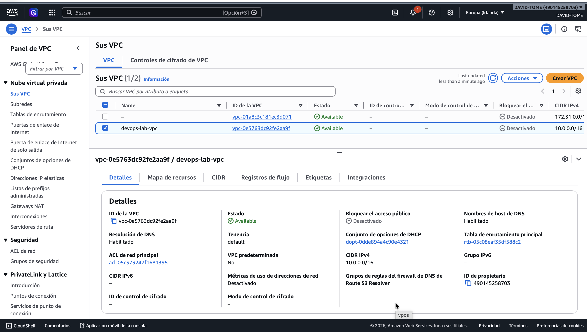
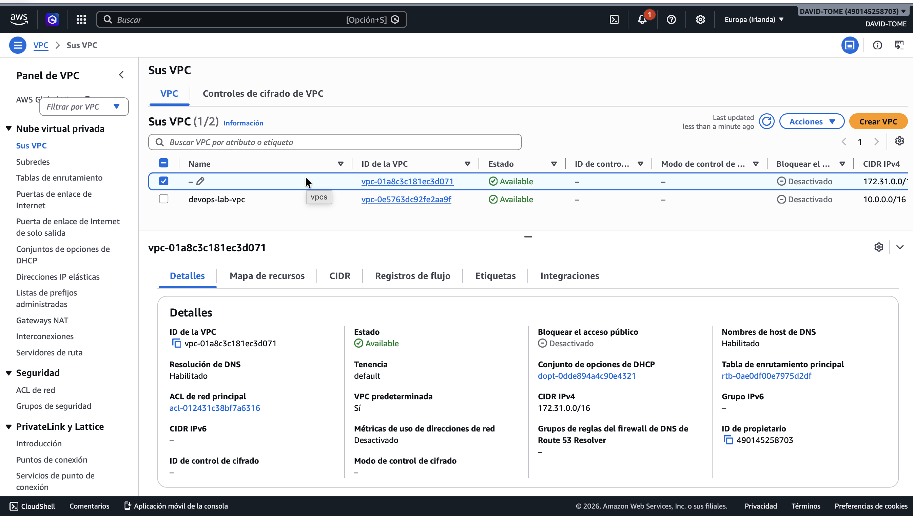
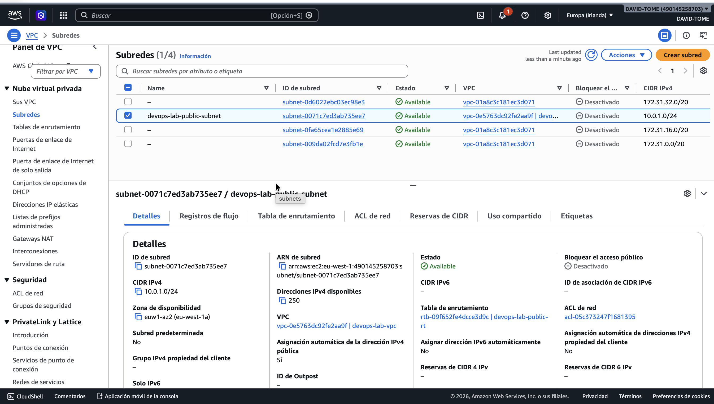
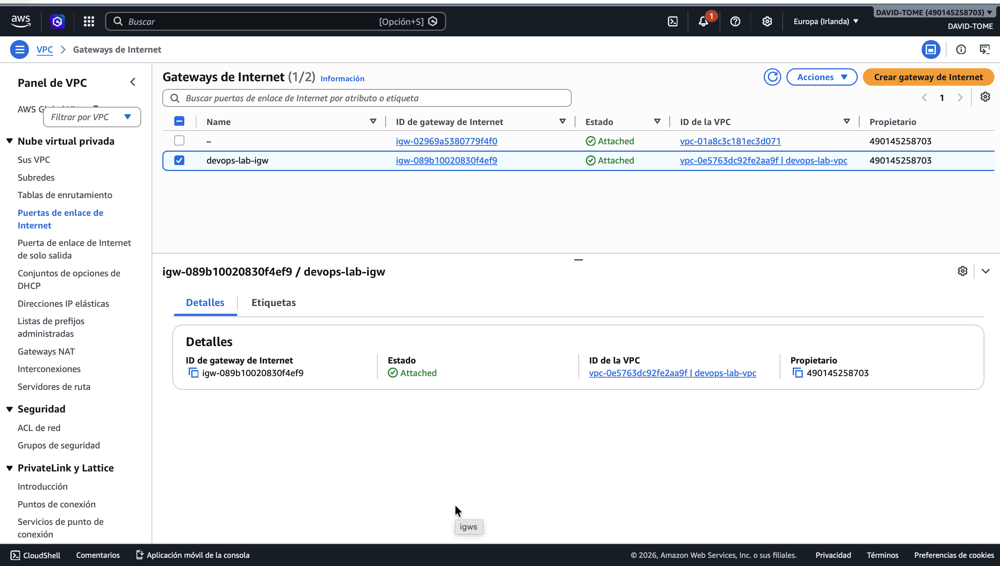
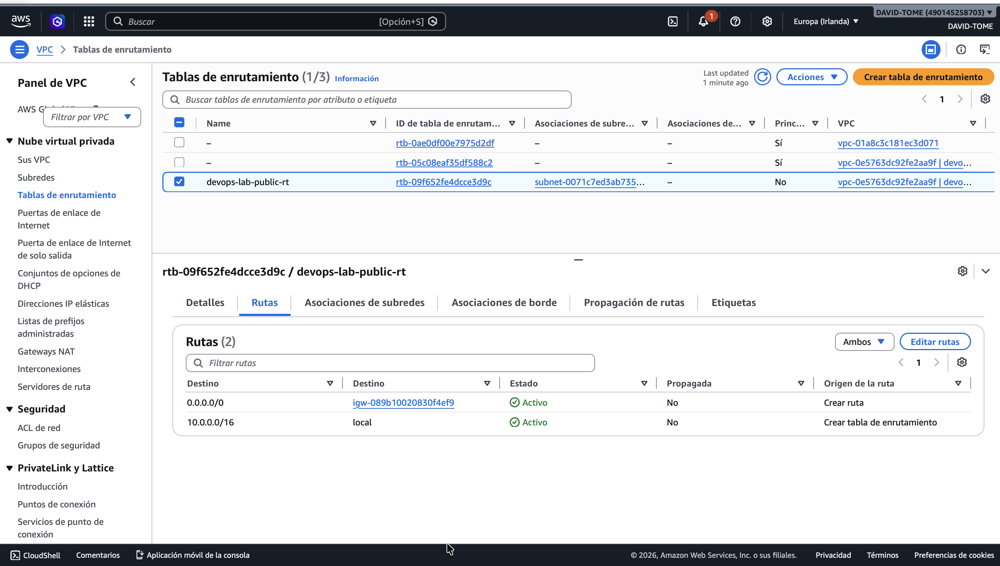
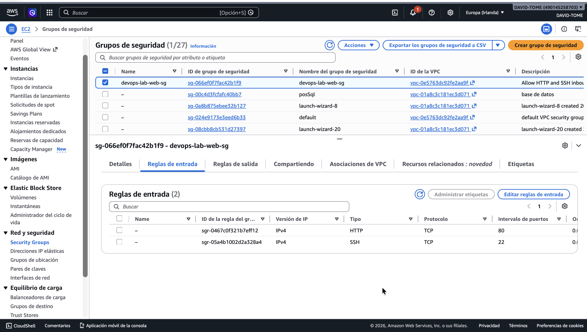
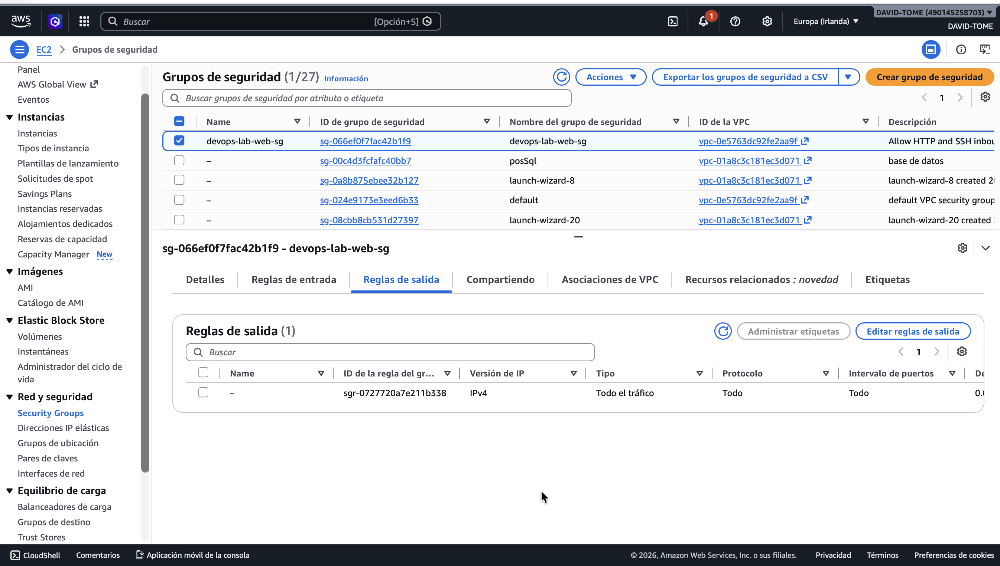
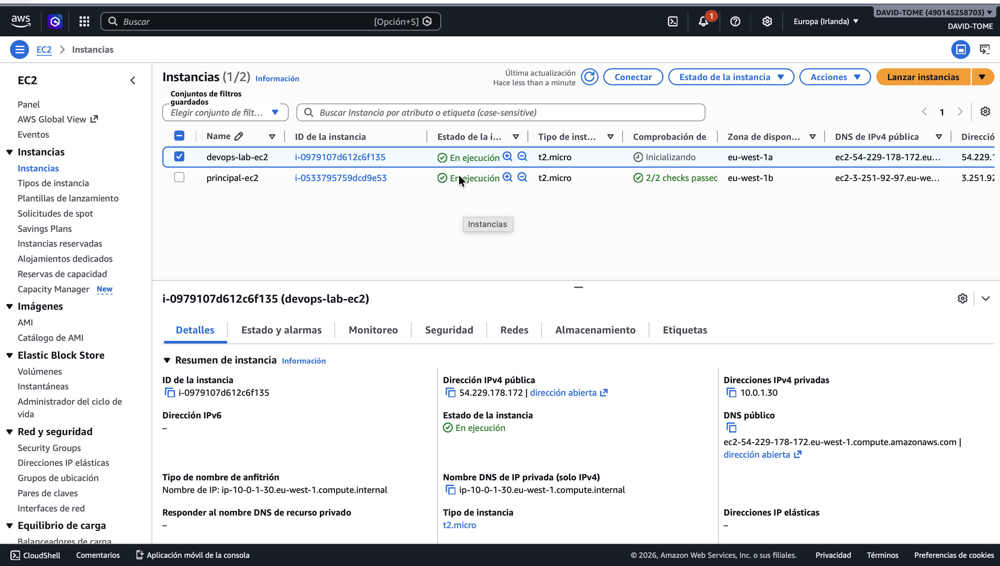
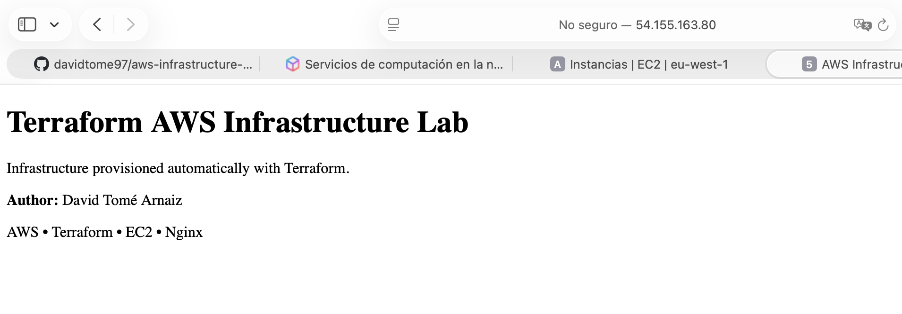
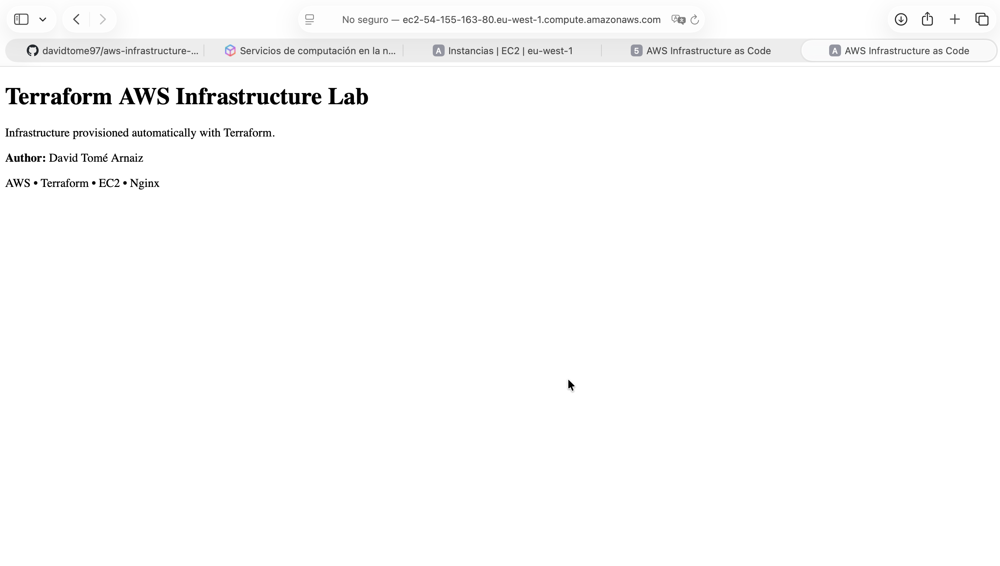

# AWS Infrastructure as Code with Terraform

Provisioning a production-style AWS networking environment with Terraform, including VPC, public subnet, Internet Gateway, security groups, routing and automatic EC2 web server deployment.

This project automatically creates a complete networking environment and deploys an EC2 instance running **Nginx**, serving a custom web page.

---


---

# Architecture

The infrastructure created by Terraform includes:

- Amazon VPC
- Public Subnet
- Internet Gateway
- Route Table
- Route Table Association
- Security Group
- Amazon EC2 Instance
- Automatic Nginx installation using User Data

---

# Architecture Overview



---

# AWS Resources

## Default VPC vs Custom VPC



---

## Public Subnet



---

## Internet Gateway



---

## Route Table



---

## Security Group - Inbound Rules



---

## Security Group - Outbound Rules



---

## EC2 Instance



---

# Automatic Web Deployment

Terraform provisions the EC2 instance and automatically executes a **User Data** script that:

- Updates the operating system
- Installs Nginx
- Starts the Nginx service
- Enables the service at boot
- Deploys a custom HTML page

---

## Access using Public IP



---

## Access using Public DNS



---

# Technologies

- Terraform
- AWS EC2
- AWS VPC
- AWS Networking
- Amazon Linux 2023
- Nginx
- Infrastructure as Code (IaC)

---

# Project Structure

```text
aws-infrastructure-as-code/

├── images/
│   ├── default-vpc-vs-custom-vpc.png
│   ├── ec2-instance.png
│   ├── internet-gateway.png
│   ├── public-route-table.png
│   ├── public-subnet.png
│   ├── security-group-inbound.png
│   ├── security-group-outbound.png
│   ├── terraform-nginx-home-dns.png
│   ├── terraform-nginx-home-ip.png
│   └── vpc-overview.png
│
├── terraform/
│   ├── provider.tf
│   ├── versions.tf
│   ├── variables.tf
│   ├── terraform.tfvars
│   ├── main.tf
│   ├── outputs.tf
│   └── .terraform.lock.hcl
│
├── .gitignore
└── README.md
```

---

# Resources Created

| Resource | Status |
|----------|:------:|
| VPC | ✅ |
| Public Subnet | ✅ |
| Internet Gateway | ✅ |
| Route Table | ✅ |
| Route Table Association | ✅ |
| Security Group | ✅ |
| EC2 Instance | ✅ |
| Nginx | ✅ |

---

# Deployment

## Initialize Terraform

```bash
terraform init
```

## Format configuration

```bash
terraform fmt
```

## Validate configuration

```bash
terraform validate
```

## Review execution plan

```bash
terraform plan
```

## Deploy infrastructure

```bash
terraform apply
```

## Destroy infrastructure

```bash
terraform destroy
```

---

# Outputs

Terraform automatically returns:

- VPC ID
- Public Subnet ID
- Security Group ID
- EC2 Public IP
- EC2 Public DNS

---

# Skills Demonstrated

- Infrastructure as Code (IaC)
- AWS Networking
- VPC Design
- Public Networking
- Security Groups
- EC2 Provisioning
- User Data Automation
- Terraform Variables
- Terraform Outputs
- Resource Dependencies
- Infrastructure Lifecycle Management

---

# Possible Next Steps

- Remote State (Amazon S3)
- State Locking (DynamoDB)
- Terraform Modules
- Elastic IP
- Application Load Balancer
- Auto Scaling Group
- GitHub Actions CI/CD
- HTTPS using ACM
- Route 53 DNS

---

# Author

**David Tomé Arnaiz**

Cloud & DevOps Engineer

AWS Certified Solutions Architect – Associate

AWS Certified Cloud Practitioner

LinkedIn:
https://linkedin.com/in/david-tome-arnaiz-442729399

---

## License

This project is licensed under the MIT License. See the [LICENSE](LICENSE) file for details.
